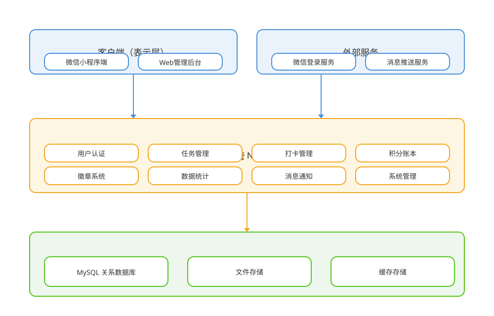
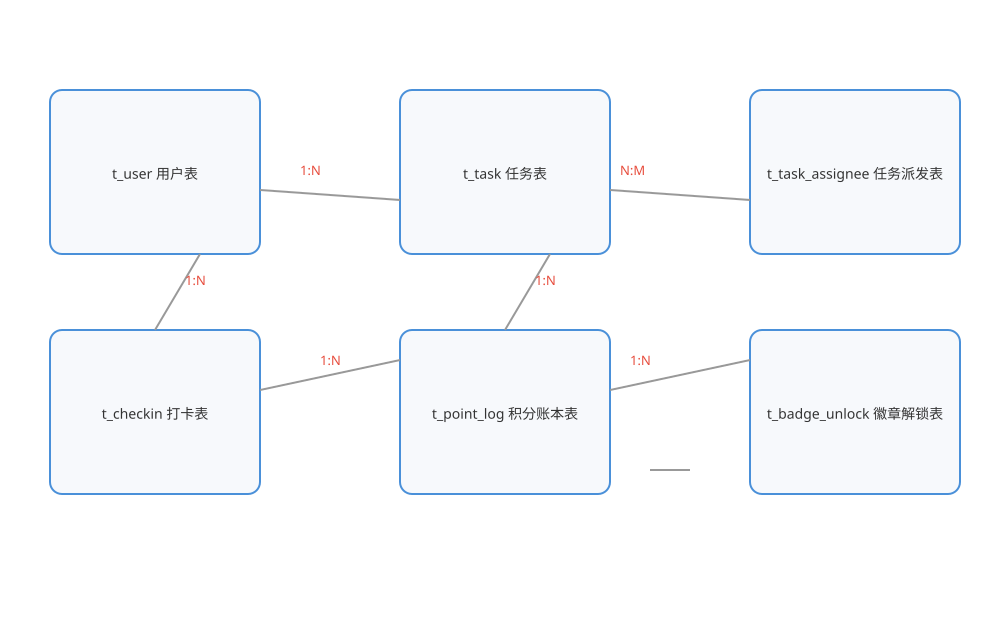
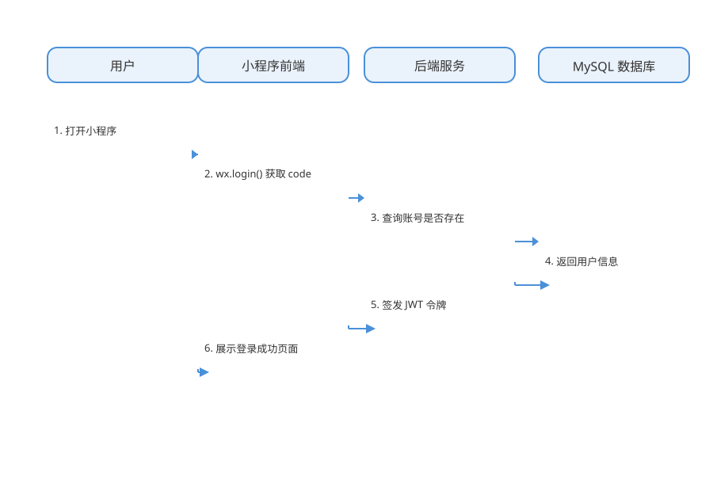
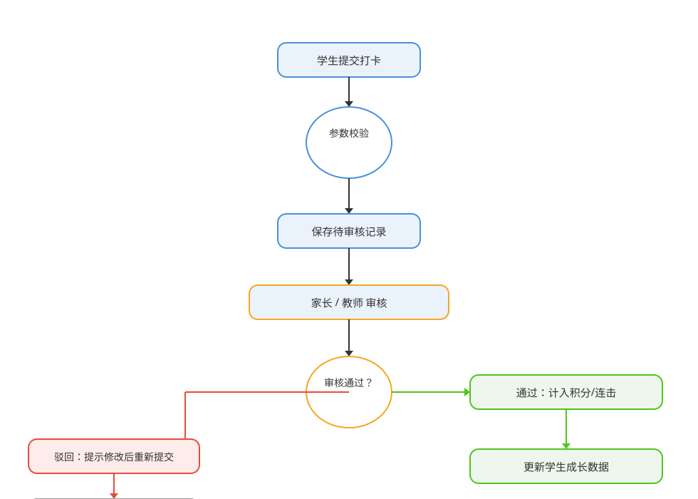

# 学习星球打卡任务管理系统 项目说明书


# 学习星球打卡任务管理系统

## 项目说明书

```
文档版本：V1.0
文档密级：内部资料
编制日期：2026 年 8 月
```


---


## 文档控制信息


| 项目 | 内容 |
| --- | --- |
| 软件名称 | 学习星球打卡任务管理系统 |
| 软件版本 | V1.2.0 |
| 文档版本 | V1.0 |
| 编写单位 | 项目开发组 |
| 编写人 | 项目组成员 |
| 审核人 | 项目负责人 |
| 编制日期 | 2026 年 8 月 |
| 适用范围 | 软件著作权登记、项目评审与后期维护参考 |


### 文档修订记录


| 版本 | 日期 | 修订说明 | 修订人 |
| --- | --- | --- | --- |
| V1.0 | 2026-08-25 | 创建文档，完成全部章节编制 | 开发组 |


## 目 录

- 1 引言

- 2 软件概述

- 3 系统总体设计

- 4 功能模块设计

- 5 数据库设计

- 6 接口设计

- 7 核心流程设计

- 8 用户操作手册

- 9 部署与维护

- 10 测试与质量保障

- 11 附录


---


## 1 引言


### 1.1 编写目的

本文档旨在对《学习星球打卡任务管理系统》软件进行全面、系统的描述，从软件的功能范围、系统结构、技术方案、数据模型、接口规范、业务流程、操作方式、部署运维等方面进行详细说明，作为软件著作权登记申请的重要技术支撑材料。同时，本文档也作为软件项目开发、测试、验收、维护及后续升级的重要参考资料。

通过本文档，评审人员、登记审查人员以及后续参与本软件维护与扩展的开发人员，可以完整、准确地理解本软件的设计思想、功能构成与实现方案。文档内容与软件的实际运行行为保持一致，力求客观、准确、详尽。


### 1.2 项目背景

随着素质教育的深入推进和社会对少年儿童全面发展的关注，家长对孩子的学习过程管理与行为习惯养成的重视程度不断提升。传统的学习任务安排往往依赖纸质清单或口头叮嘱，普遍存在任务记录分散、进度监督困难、完成情况统计繁琐、缺乏有效激励等问题。

针对上述痛点，本项目立项研发一套面向中小学生家庭的学习打卡与成长管理平台。平台将学习任务的管理、每日打卡的记录、审核机制的建立、积分与徽章激励体系的引入有机结合，帮助家长和教师以较低的使用成本实现对学习过程的有效管理，帮助学生通过游戏化的激励机制养成坚持学习的良好习惯。

项目采用微信小程序作为用户入口，依托微信庞大的用户基础与便捷的使用体验，降低用户的获取与使用门槛；后端采用云托管方式部署，具备弹性伸缩、按量计费、免运维等优势，适合中小规模应用的快速上线与迭代。


### 1.3 编制依据

本说明书的编制主要依据以下材料：

（1）《学习星球打卡任务管理系统需求规格说明》：明确了软件的功能需求与非功能需求。

（2）《学习星球打卡任务管理系统系统设计说明》：确定了系统的总体架构与模块划分。

（3）《学习星球打卡任务管理系统数据库设计说明》：定义了数据模型与表结构。

（4）软件源代码及相关开发文档。

（5）《计算机软件著作权登记办法》及软件著作权登记申请材料的相关格式要求。


### 1.4 适用范围与读者对象

本文档适用于本软件从需求分析、设计开发、测试验收、部署上线到后期维护的全生命周期。主要读者对象包括：软件著作权登记审查人员、项目管理人员、系统分析人员、开发与测试人员、运维人员以及使用本软件的管理员与用户。


### 1.5 术语与缩写


| 术语/缩写 | 说明 |
| --- | --- |
| JWT | JSON Web Token，一种基于 JSON 的开放标准令牌格式，用于接口鉴权 |
| REST | Representational State Transfer，表述性状态转移，一种接口设计风格 |
| MySQL | 一种开源的关系型数据库管理系统 |
| 小程序 | 运行于微信客户端内的轻量级应用程序，无需下载安装 |
| 云托管 | 微信云开发提供的容器化后端托管与部署服务 |
| 打卡 | 学生完成学习任务后在平台内提交的签到记录 |
| 积分 | 学生完成任务或打卡审核通过后获得的可累计经验值 |
| 徽章 | 根据学生成长数据自动解锁的成就奖励标识 |
| API | Application Programming Interface，应用程序编程接口 |
| ER | Entity-Relationship，实体-关系，用于数据模型设计 |
| CRUD | Create / Read / Update / Delete，数据的增删改查操作 |
| UTC | Coordinated Universal Time，协调世界时 |
| HTTPS | Hyper Text Transfer Protocol Secure，超文本传输安全协议 |


### 1.6 系统边界

本软件的功能边界如下：

（1）范围之内：学习任务管理、每日打卡与审核、积分等级与徽章激励、家庭多角色协同、管理后台数据管理与统计、订阅消息通知等核心业务功能。

（2）范围之外：本软件不提供在线课程播放、直播教学、在线考试等教学内容生产与交付功能，仅聚焦于学习任务的过程管理与行为激励。

（3）外部依赖：本软件依赖微信平台提供的小程序运行环境、登录服务与订阅消息能力，依赖微信云托管与对象存储等云基础设施。


### 1.7 文档约定

（1）本说明书中“系统”与“平台”均指《学习星球打卡任务管理系统》软件。

（2）文中出现的接口地址均以 /api 为前缀的相对路径，完整地址由部署域名拼接。

（3）数据表中字段类型的表述与 MySQL 8.0 数据类型保持一致。

（4）文中示例数据均为演示数据，不包含真实用户信息。


## 2 软件概述


### 2.1 软件简介

《学习星球打卡任务管理系统》是一套面向中小学生家庭的在线学习打卡与成长管理软件。软件以“任务—打卡—积分—徽章—统计”为业务主线，帮助家长、教师与学生建立清晰的学习任务体系，记录并追踪学生的每日学习打卡情况，并通过积分、等级、徽章等游戏化激励手段，激发学生的自主学习兴趣与坚持学习的习惯。

软件整体采用“微信小程序 + 云托管后端 + Web 管理后台”的三端架构。微信小程序端面向家长与学生提供移动端使用入口，实现任务的查看、打卡的提交、积分与徽章的展示等功能；云托管后端基于 Node.js 与 Express 框架提供统一的数据服务与业务逻辑处理；Web 管理后台面向管理员与家长提供用户管理、任务管理、打卡审核、数据统计、系统监控等管理能力。

软件在设计上充分考虑了家庭多成员协同的场景，支持主家长、家属、学生等多种角色，同一微信账号可绑定多种身份并安全切换，家庭成员可共享同一套学习管理数据，共同参与孩子的学习成长过程。


### 2.2 软件构成

本软件由三大部分构成：

（1）微信小程序端：面向学生与家长，提供登录、任务、打卡、积分、徽章、身份切换等核心功能。

（2）后端服务端：提供统一的数据接口服务，包含用户认证、任务管理、打卡管理、积分账本、徽章系统、数据统计、消息通知、系统管理等业务模块。

（3）Web 管理后台：面向管理员与家长，提供数据管理与业务审核的可视化操作界面。


### 2.3 用户角色


| 角色 | 主要职责 | 使用端 |
| --- | --- | --- |
| 平台管理员 | 系统配置、用户管理、数据字典、监控审计 | Web 管理后台 |
| 教师/家长 | 创建任务、派发任务、审核打卡、查看统计 | 小程序 + 管理后台 |
| 家属 | 参与家庭任务与打卡审核 | 小程序 |
| 学生 | 查看本人任务、提交打卡、查看积分徽章 | 小程序 |


### 2.4 主要功能特性

本软件的主要功能特性如下：

（1）学习任务管理：支持任务的创建、编辑、删除、查询与状态流转，任务包含科目、标签、描述、图片、分值、起止日期等信息，支持按合集归类、按学生派发。

（2）每日打卡：学生针对任务提交打卡记录，支持文字、图片、语音多类型媒体，系统自动记录打卡日期与连续打卡天数。

（3）内容审核：打卡默认进入待审核状态，家长或教师审核通过后正式展示，支持通过、驳回操作，未过审内容脱敏展示。

（4）积分与等级：打卡审核通过与任务完成自动累加积分，积分以账本形式记录流水、可追溯可减分，并按积分自动计算学生等级。

（5）成就徽章：按连续打卡、累计打卡、任务完成、等级成长等维度自动解锁徽章，形成激励闭环。

（6）多身份协同：支持主家长、家属、学生多角色，同一微信可绑定多种身份并安全切换，家长身份可设置 PIN 锁。

（7）管理后台：提供用户管理、任务管理、打卡审核、数据统计、数据字典、系统监控、操作审计等管理功能。

（8）安全控制：采用 JWT 鉴权、邀请码绑定、登录限流、账号注销冷静期、操作审计等多重安全机制。


### 2.5 运行环境


| 类别 | 环境要求 |
| --- | --- |
| 客户端（小程序） | iOS 或 Android 系统手机，安装微信客户端（支持基础库 2.x） |
| 管理后台 | Chrome、Edge、Firefox 等主流浏览器 |
| 服务器 | Node.js 18 及以上运行环境，Linux 操作系统 |
| 数据库 | MySQL 8.0 及以上，utf8mb4 字符集，InnoDB 引擎 |
| 媒体存储 | 兼容 COS/S3 协议的对象存储服务 |
| 网络 | 可访问互联网，支持 HTTPS 加密通信 |


### 2.6 软件特点与优势

（1）轻量便捷：用户无需安装独立 App，通过微信小程序即可使用，学习成本低、触达方便，特别适合家庭场景。

（2）游戏化激励：积分、等级、徽章与连续打卡等多种激励手段相结合，有效提升学生持续打卡的动力与成就感。

（3）数据安全可靠：业务数据集中存储于 MySQL，密码采用 bcrypt 单向哈希存储，敏感操作全程留痕审计，接口具备完善的鉴权与权限控制。

（4）多角色协同：家长、家属、学生等角色职责清晰，同一微信可承载多身份并安全切换，契合家庭共同育人的使用场景。

（5）架构清晰可扩展：前后端分离，接口规范统一，模块化设计便于后续功能扩展与二次开发。


### 2.7 业务流程总览

本软件的核心业务流程可概括为“建任务—做任务—打打卡—审内容—得积分—领徽章”六个环节，具体如下：

第一步，家长或教师在平台创建学习任务，任务包含科目、内容、分值、截止日期等信息，并选择派发的学生。任务创建后进入待办状态，出现在相关学生的任务列表与待办提醒中。

第二步，学生根据任务要求开展学习，完成任务后进入任务详情页提交打卡。打卡支持文字描述并可选附图片或语音，系统记录打卡日期，任务首次打卡后自动转为进行中状态。

第三步，家长或教师对学生打卡内容进行审核，审核通过后打卡正式展示并累计积分，审核驳回则提示学生修改后重新提交。

第四步，系统依据打卡与任务完成情况自动计算积分，积分以账本形式记录流水，同时更新学生连续打卡天数与等级。

第五步，学生成长指标达到条件后自动解锁成就徽章，徽章展示于小程序徽章墙，形成“努力—奖励—再努力”的激励闭环。

第六步，家长可在管理后台查看学习仪表盘，掌握孩子的任务完成率、打卡频率、积分成长与科目分布等数据，及时调整学习安排。


### 2.8 主要数据流

系统主要数据流描述如下：

（1）登录数据流：用户输入账号密码，前端将凭证提交后端，后端校验并签发令牌，令牌随后续请求传递，实现身份认证。

（2）任务数据流：任务信息由创建端提交后端，写入任务表与派发表；任务列表与详情由后端按条件查询返回前端展示。

（3）打卡数据流：打卡内容提交后端，写入打卡表；审核操作更新审核状态；审核通过后触发积分流水写入与积分余额更新。

（4）统计数据流：后台统计模块从任务、打卡、积分等表聚合数据，生成仪表盘指标与趋势图返回前端渲染。

（5）审计数据流：后台关键操作实时写入审计日志表，供监控模块查询与追溯。


### 2.9 小程序页面清单

微信小程序端主要页面及其功能说明如下：


| 页面 | 功能说明 |
| --- | --- |
| 首页 | 展示今日概览、连续打卡、积分、徽章与待办提醒 |
| 任务列表 | 查看全部任务，支持状态、科目筛选 |
| 任务详情 | 查看任务信息与打卡记录，提交打卡 |
| 任务编辑 | 创建与编辑任务 |
| 打卡提交 | 填写打卡内容并上传图片/语音 |
| 我的 | 查看个人资料、积分等级与徽章墙 |
| 登录注册 | 账号注册与登录 |
| 徽章墙 | 查看全部徽章与解锁进度 |
| 孩子档案 | 维护孩子信息与生成学生邀请码 |
| 家属共享 | 生成与管理家属共享邀请码 |
| 学习管理 | 维护学习合集与科目 |
| 身份选择 | 选择家长/个人/邀请码绑定身份 |


### 2.10 管理后台页面清单


| 页面 | 功能说明 |
| --- | --- |
| 登录页 | 后台账号登录 |
| 数据概览 | 任务、打卡、用户等核心指标展示 |
| 用户管理 | 用户搜索、启用禁用 |
| 任务管理 | 任务增删改查与派发 |
| 打卡审核 | 打卡记录筛选与审核 |
| 数据字典 | 字典类型与字典项维护 |
| 学习仪表盘 | 学生视角统计与趋势分析 |
| 系统监控 | 运行指标与接口链路追踪 |
| 邀请码管理 | 各类邀请码生成与失效管理 |
| 注销管理 | 账号注销申请集中处理 |


### 2.11 系统权限矩阵


| 功能/角色 | 管理员 | 教师/家长 | 家属 | 学生 |
| --- | --- | --- | --- | --- |
| 任务创建与派发 | 允许 | 允许 | 允许 | 仅本人 |
| 打卡提交 | 允许 | 允许 | 允许 | 允许 |
| 打卡审核 | 允许 | 允许 | 允许 | 不允许 |
| 积分徽章查看 | 允许 | 允许 | 允许 | 允许 |
| 孩子档案维护 | 允许 | 允许 | 仅查看 | 不允许 |
| 数据字典维护 | 允许 | 不允许 | 不允许 | 不允许 |
| 系统监控 | 允许 | 不允许 | 不允许 | 不允许 |
| 邀请码管理 | 允许 | 部分 | 不允许 | 不允许 |
| 账号注销 | 允许 | 允许 | 允许 | 允许 |


### 2.12 软件质量特性

本软件在开发过程中着重保障以下质量特性：

（1）正确性：各功能模块实现与需求规格一致，核心业务逻辑经过充分测试验证。

（2）可靠性：接口异常兜底完善，关键业务事务化处理，服务具备多实例容灾能力。

（3）易用性：界面简洁直观，操作路径短，关键操作均有明确的提示与引导。

（4）安全性：鉴权、限流、审计、数据隔离等安全机制覆盖全面。

（5）可维护性：代码模块化、接口规范化、文档齐全，便于后续维护与扩展。

（6）可移植性：后端基于容器化部署，可平滑迁移至主流云环境。


## 3 系统总体设计


### 3.1 设计目标

本系统总体设计的目标是构建一个功能完整、结构清晰、性能稳定、安全可靠、易于扩展的学习打卡与成长管理平台，具体目标如下：

（1）功能完整性：覆盖任务管理、打卡管理、审核管理、积分激励、数据统计等完整业务闭环。

（2）架构合理性：采用分层架构与前后端分离设计，各层职责清晰、耦合度低，便于维护与扩展。

（3）性能可用性：核心接口响应迅速，支持并发访问，通过多实例部署与水平扩展保障服务可用。

（4）安全性：建立完善的鉴权、校验、限流与审计机制，保障用户数据与系统安全。

（5）可观测性：具备接口链路追踪与系统运行监控能力，便于问题定位与运维。


### 3.2 设计原则

系统总体设计遵循以下原则：

（1）分层设计原则：系统按表示层、应用服务层、数据存储层分层组织，各层职责单一、边界清晰。

（2）前后端分离原则：小程序与管理后台仅通过标准化 REST 接口与后端交互，前端不直接访问数据库，保证数据安全。

（3）模块化原则：业务按功能模块拆分，模块之间低耦合、高内聚，支持独立开发、测试与部署。

（4）安全优先原则：接口鉴权、参数校验、限流防刷、操作审计等安全能力贯穿系统设计。

（5）可观测原则：通过接口链路追踪与系统监控能力，及时发现并定位运行问题。


### 3.3 系统总体架构

系统总体架构分为三个层次：客户端层、应用服务层与数据存储层。系统总体架构如下图所示：




*图 3-1 系统总体架构图*

客户端层负责用户交互与数据展示：微信小程序端面向家长与学生，提供任务、打卡、积分、徽章等核心功能，并通过微信云开发环境内调用能力直连后端服务；Web 管理后台面向管理员与家长，提供数据管理与业务审核能力。

应用服务层接收客户端请求，完成业务逻辑处理。服务层内部按功能划分为用户认证、任务管理、打卡管理、积分账本、徽章系统、数据统计、消息通知、系统管理等模块，各模块通过统一的数据访问组件读写数据存储层。

数据存储层承载核心业务数据与媒体资源：MySQL 关系数据库存储用户、任务、打卡、积分、徽章等结构化业务数据；对象存储服务承载图片、语音等媒体文件；缓存存储用于加速热点数据访问。


### 3.4 技术选型

系统技术选型遵循成熟稳定、生态丰富、易于维护的原则，各层技术选型如下表所示：


| 层次 | 技术 | 说明 |
| --- | --- | --- |
| 小程序前端 | 微信小程序原生 + JavaScript | 页面与组件使用微信原生小程序技术 |
| 后台前端 | React 18 + Ant Design 5 | 管理后台界面与组件库 |
| 构建工具 | Vite 5 | 后台前端工程化构建工具 |
| 后端 | Node.js 18 + Express 4 | REST 接口服务与中间件体系 |
| 数据库 | MySQL 8.0 | 业务数据持久化存储 |
| 鉴权 | JWT | 用户与管理员令牌鉴权 |
| 密码 | bcrypt | 密码单向哈希存储 |
| 媒体处理 | sharp / ffmpeg | 图片压缩与音视频处理 |
| 容器化 | Docker | 服务镜像构建与部署 |
| 部署 | 微信云托管 | 容器服务托管与弹性伸缩 |

选择 Node.js 与 Express 作为后端技术栈，主要考虑其异步 I/O 模型适合高并发接口场景，生态丰富、开发效率高，且与微信云托管平台无缝集成。数据库选择 MySQL，具备良好的事务支持、成熟稳定、运维资料丰富。后台前端选择 React 与 Ant Design，组件丰富、社区活跃，可快速构建企业级后台界面。


### 3.5 系统目录结构

后端服务代码按职责划分目录，核心目录结构如下：

（1）入口与配置：服务入口文件负责初始化 HTTP 服务与挂载路由；配置模块集中管理端口、数据库连接、密钥等运行参数。

（2）数据访问：数据库连接模块基于连接池封装统一的查询与事务能力，业务模块通过统一数据访问接口读写数据库。

（3）中间件：鉴权中间件负责 JWT 令牌校验与用户信息挂载；限流中间件基于滑动窗口限制高频请求。

（4）路由：按业务域划分认证、用户、任务、打卡、积分、徽章、后台管理等多个路由模块。

（5）服务层：封装任务、打卡、积分、连击、统计、审计等核心业务逻辑，供路由层调用。

（6）工具模块：提供统一响应、日志、参数校验、令牌签发、分页解析等通用能力。

（7）数据库脚本：包含建表脚本与种子数据脚本，支撑数据库初始化。


### 3.6 系统部署结构

后端服务以 Docker 容器方式部署于微信云托管平台，通过负载均衡对外提供服务。数据库使用 MySQL 实例，图片、语音等媒体文件存储于对象存储服务。小程序通过云开发环境内调用能力直连后端服务，管理后台通过公网访问后端接口。

系统支持多实例水平扩展，通过健康检查与自动伸缩保障服务可用性；数据库支持主从部署与定时备份，保障数据安全。


### 3.7 安全架构设计

系统从传输、身份、权限、数据、操作五个层面构建纵深安全防护体系：

（1）传输安全：客户端与服务器之间采用 HTTPS 加密通信，防止数据在传输过程中被窃听或篡改。

（2）身份安全：密码采用 bcrypt 单向哈希存储，即使数据库泄露也无法还原明文密码；JWT 令牌设置有效期，过期自动失效。

（3）权限安全：后台基于角色-菜单权限体系，非管理员只能访问授权范围内的功能与数据，越权访问返回 403。

（4）数据安全：业务数据按表前缀与应用归属字段隔离，家庭数据互不可见；敏感操作记录审计日志，全程可追溯。

（5）行为安全：登录、绑定等敏感接口实施限流防刷，邀请码单次使用即作废，账号注销提供冷静期机制防止误操作。


### 3.8 可观测性设计

系统内置完善的观测能力，支撑运行监控与问题定位：

（1）接口链路追踪：前端请求携带全局请求标识，服务端记录接口路径、耗时、状态码与客户端指纹，形成完整调用链路。

（2）系统监控：定时采集服务 CPU、内存、实例规格、活跃连接等运行指标，写入监控数据表并可视化展示。

（3）日志体系：统一分级日志输出，记录请求访问、业务异常与关键操作，便于排查问题。

（4）审计体系：后台关键操作与用户核心操作均记录审计事件，支撑安全审计与责任追溯。


### 3.9 关键非功能指标


| 指标项 | 目标值 |
| --- | --- |
| 接口平均响应时间 | 500 毫秒以内 |
| 接口最长响应时间 | 3 秒以内 |
| 服务可用性 | 99.9% 以上 |
| 单实例并发支持 | 50 并发以上 |
| 数据备份周期 | 每日全量、小时级增量 |
| 故障恢复时间 | 30 分钟以内 |


### 3.10 异常处理策略

系统建立统一的异常处理机制：

（1）参数异常：所有接口在进入业务逻辑前进行参数校验，参数非法时返回明确的业务错误码与提示信息。

（2）业务异常：业务规则校验失败（如无权限、状态非法、资源不存在）时返回对应的业务状态码。

（3）系统异常：未预期异常由全局异常兜底处理，统一返回服务器内部错误，并记录详细日志供排查。

（4）网络异常：前端统一封装网络异常处理，提供重试与友好提示，避免异常界面。

（5）事务异常：涉及多表写入的业务在事务中执行，任一步骤失败整体回滚，保证数据一致性。


### 3.11 部署与运维边界

本系统部署与运维边界如下：

（1）开发环境：用于日常开发与自测，数据使用模拟数据。

（2）测试环境：用于测试与验收，数据来源于测试用例。

（3）预发布环境：用于上线前最终验证，配置与生产保持一致。

（4）生产环境：正式对外服务，启用完整的安全与监控能力。


## 4 功能模块设计


### 4.1 模块划分

系统按业务职责划分为八大功能模块：用户认证模块、任务管理模块、打卡管理模块、积分与徽章模块、数据统计模块、管理后台模块、消息通知模块与系统安全模块。各模块功能划分清晰、相互协同，共同构成完整的业务闭环。模块划分如下表所示：


| 模块 | 主要职责 |
| --- | --- |
| 用户认证模块 | 注册登录、令牌签发与校验、身份绑定与切换、账号注销 |
| 任务管理模块 | 任务创建、编辑、删除、状态流转与派发、合集归类 |
| 打卡管理模块 | 打卡提交、查询、审核与删除、媒体管理 |
| 积分与徽章模块 | 积分账本、等级计算、徽章解锁与展示 |
| 数据统计模块 | 学习仪表盘、趋势统计、科目分布、提醒生成 |
| 管理后台模块 | 用户/任务/打卡管理、数据字典、系统监控 |
| 消息通知模块 | 订阅授权、审核结果与打卡提醒发送 |
| 系统安全模块 | 接口限流、操作审计、邀请码管理、PIN 锁 |


### 4.2 用户认证模块

用户认证模块负责用户的注册、登录、令牌签发与身份管理，是整个系统安全体系的入口。

用户可通过账号密码方式在小程序端或管理后台完成注册与登录。后端对密码进行 bcrypt 单向哈希存储，登录时校验通过后签发 JWT 令牌，客户端在后续请求中携带令牌访问受保护接口。令牌包含有效期，过期后需重新登录，账号被禁用时令牌立即失效。

针对家庭使用场景，平台支持多种身份类型：主家长负责创建任务、维护孩子档案与审核打卡；家属在获得共享邀请码后可加入家庭协同管理；学生通过学生邀请码绑定后仅可查看本人任务并提交打卡；个人身份无需家庭关系，自己发布任务自己打卡。

同一微信账号支持绑定多种身份并可自由切换，切换至家长身份时可设置 PIN 锁防止孩子越权操作。模块还提供资料修改、密码修改、账号注销等功能。注销支持立即注销与 7 天冷静期注销两种模式，冷静期内暂停业务功能，到期后由系统定时任务自动完成注销。


| 功能点 | 说明 |
| --- | --- |
| 注册 | 填写账号、密码、姓名，校验唯一性后创建账号 |
| 登录 | 账号密码校验，签发 JWT 令牌 |
| 获取当前用户 | 校验令牌并返回当前用户信息 |
| 退出登录 | 前端丢弃令牌完成退出 |
| 资料维护 | 修改姓名、头像、性别、学校、年级等信息 |
| 修改密码 | 校验原密码后更新为新密码 |
| 身份绑定 | 通过邀请码绑定学生、家属等身份 |
| 身份切换 | 同一微信多身份间安全切换 |
| 账号注销 | 立即注销或 7 天冷静期注销 |


### 4.3 任务管理模块

任务管理模块是平台的核心业务模块，负责学习任务的创建、编辑、删除、查询与派发。任务信息包括标题、科目、标签、描述、相关链接、图片、分值、起止日期、合集归属等字段。

任务状态分为待办、进行中、已完成三种，支持状态流转。任务可派发给一个或多个学生：学生创建的任务默认派发给本人，管理员或家长可对任务进行多选派发。任务支持按科目、状态、关键字进行检索，并支持按合集归类管理。

模块同时记录任务的全生命周期时间轴，包括创建、更新、完成、删除、打卡等关键事件，为后台审计与问题追溯提供依据。删除任务时系统统计关联打卡与图片数量，确认后级联清理相关数据，保证数据一致性。


| 功能点 | 说明 |
| --- | --- |
| 任务列表 | 按科目、状态、关键字分页查询任务 |
| 任务详情 | 查看任务完整信息与派发学生列表 |
| 创建任务 | 填写标题、科目、描述、分值、日期等信息 |
| 编辑任务 | 修改任务各项属性与状态 |
| 删除任务 | 级联清理派发、打卡与图片数据 |
| 状态流转 | 待办、进行中、已完成三态流转 |
| 任务派发 | 支持单个或多个学生派发 |
| 合集管理 | 任务按合集归类，删除合集自动解除归属 |
| 时间轴 | 记录任务全生命周期关键事件 |


### 4.4 打卡管理模块

打卡管理模块负责学生打卡记录的提交、查询、审核与删除。学生完成任务后，可针对任务提交打卡记录，打卡内容支持文字、图片、语音等多种形式，并记录打卡日期。

为保证打卡内容质量，打卡记录默认进入待审核状态，由家长或教师审核通过后方可正式展示。审核支持通过、驳回两种操作，驳回后可修改并重新提交，重新进入审核流程。待审核或已驳回的内容在展示时进行脱敏处理，防止未审核信息被传播。

任务被首次打卡后自动由待办状态转为进行中；任务完成后禁止修改或删除打卡记录。删除打卡时同步调整积分账本，保证数据一致性。


| 功能点 | 说明 |
| --- | --- |
| 提交打卡 | 针对任务提交文字、图片、语音打卡 |
| 打卡列表 | 按任务、学生、审核状态查询打卡记录 |
| 打卡详情 | 查看打卡内容与审核信息 |
| 审核打卡 | 通过、驳回操作并记录审核意见 |
| 删除打卡 | 删除打卡并同步扣减积分 |
| 脱敏展示 | 未过审内容正文与图片脱敏处理 |
| 任务联动 | 首次打卡自动转为进行中状态 |


### 4.5 积分与徽章模块

积分与徽章模块是平台的激励体系。打卡审核通过记 10 分，任务完成记 30 分；删除已通过的打卡扣 10 分，已完成任务回退或删除时按规则扣减相应积分。积分以账本形式记录，每一次加减分均产生一条流水，积分余额等于账本累加值，杜绝误计与只增不减的问题。

根据积分余额自动计算学生等级，等级共分 10 级，满级为 3200 经验值，经验上限可配置调整。徽章体系包含累计打卡、连续打卡、任务完成、等级成长、科目覆盖等系列徽章，学生成长数据达标后自动解锁并记录解锁时间，可在小程序徽章墙中查看。


| 功能点 | 说明 |
| --- | --- |
| 积分账本 | 每次加减分写入一条流水记录 |
| 等级计算 | 按积分余额自动计算学生等级 |
| 徽章解锁 | 按达成条件自动解锁徽章并记录时间 |
| 徽章墙 | 小程序端展示全部徽章与解锁进度 |
| 积分明细 | 后台可审计最近加减分流水 |
| 积分调整 | 管理员可手动调整积分并记录原因 |


### 4.6 数据统计模块

数据统计模块为管理后台提供学习仪表盘能力，从学生视角展示任务总数、已完成任务数、打卡总数、审核通过数等指标，并支持近 7 天打卡趋势、科目分布等统计视图。

学习仪表盘支持按学生视角切换：管理员可切换任意学生，家长仅能切换名下孩子，学生固定查看本人数据。仪表盘同时生成分级提醒文案，按逾期、未打卡、进度低、临期等维度对学生进行提醒，帮助家长及时了解学生学习状况。


| 功能点 | 说明 |
| --- | --- |
| 任务统计 | 任务总数、已完成数、进行中数 |
| 打卡统计 | 打卡总数、审核通过数 |
| 趋势分析 | 近 7 天打卡趋势统计 |
| 科目分布 | 任务按科目分布统计 |
| 学生切换 | 按学生视角切换查看数据 |
| 分级提醒 | 按风险程度生成提醒文案 |


### 4.7 管理后台模块

管理后台模块面向管理员与家长提供 Web 管理能力，包括：

（1）用户管理：用户列表、搜索、启用与禁用、角色管理。

（2）任务管理：任务的增删改查与派发管理，支持按科目、状态筛选。

（3）打卡审核：按审核状态筛选打卡记录，提供通过、驳回操作。

（4）数据字典：科目、状态等字典类型的配置管理，支持自定义颜色标签。

（5）系统监控：服务运行指标采集、接口链路追踪、慢请求分析。

（6）操作审计：后台登录、增删改查、审核等关键操作全程留痕。

管理后台基于角色-菜单权限体系控制功能访问，不同角色仅能看到并操作其授权范围内的功能与数据。


### 4.8 消息通知模块

消息通知模块基于微信订阅消息能力，向用户推送审核结果、打卡提醒等通知。用户在授权订阅后可接收任务临期、打卡审核通过等消息，帮助学生养成按时打卡的习惯。模块记录订阅授权与发送记录，支持按模板配置发送策略。


### 4.9 系统安全模块

系统安全模块贯穿整个系统，主要安全机制包括：

（1）接口限流：对登录、绑定等敏感接口实施滑动窗口限流，防止暴力破解与恶意调用。

（2）操作审计：后台登录、增删改查、审核等关键操作记录操作人、IP、参数等审计信息。

（3）邀请码管理：学生、家长、家属邀请码分类管理、单次使用即作废。

（4）PIN 锁：家长身份可设置 PIN 锁，切换时校验防止孩子越权。

（5）数据隔离：不同小程序按表前缀隔离业务数据，不同家庭按归属字段隔离家庭数据。


### 4.17 消息通知处理流程

消息通知模块的处理流程如下：

（1）用户在小程序内触发订阅消息授权，系统记录订阅授权信息。

（2）业务事件发生时（打卡审核完成、任务临期等），系统判断用户是否已授权对应模板。

（3）已授权用户进入消息发送队列，系统调用微信订阅消息接口发送通知。

（4）发送结果写入发送记录表，供管理与追溯。

（5）发送失败时记录失败原因，支持后续重试与告警。


### 4.18 前端缓存与离线策略

为提升使用体验、降低网络开销，前端在数据缓存与离线使用方面采取以下策略：

（1）会话缓存：登录令牌与用户基本信息在本地持久化保存，冷启动时快速恢复登录态，无需重复登录。

（2）数据缓存：任务列表、科目字典等低频变更数据在本地缓存，刷新时校验有效性，减少重复请求。

（3）图片缓存：云存储图片通过 CDN 访问并启用本地缓存，配合缩略图参数降低流量消耗。

（4）离线兜底：网络异常时展示缓存数据并提示重试，避免白屏，核心操作在恢复网络后重试提交。


### 4.10 模块间交互关系

各功能模块之间存在明确的调用关系，共同支撑完整业务闭环：

（1）用户认证模块为其他所有模块提供身份与权限基础，其他模块通过令牌获取当前用户信息与角色。

（2）任务管理模块与打卡管理模块紧密关联，打卡记录归属具体任务，任务状态随打卡行为流转。

（3）打卡管理模块与积分与徽章模块联动，打卡审核通过触发积分流水写入，积分与连击数据触发徽章解锁。

（4）数据统计模块依赖任务、打卡、积分等模块的数据，通过聚合查询生成仪表盘。

（5）管理后台模块通过统一接口调用各业务模块能力，实现数据管理与业务审核。

（6）消息通知模块订阅各业务模块事件，在审核完成、任务临期等时机触发消息推送。

（7）系统安全模块作为横切能力，对各模块的登录、绑定、增删改查等操作实施鉴权、限流与审计。


### 4.11 关键业务规则说明

（1）任务派发规则：学生创建的任务强制派发给本人，管理员与家长可按需多选派发；派发对象须为启用状态的学生角色账号。

（2）打卡审核规则：所有学生打卡默认进入待审核状态；家长与管理员提交的打卡自动审核通过；已驳回打卡可修改后重新提交，重新进入审核流程。

（3）任务状态规则：任务被首次打卡后由待办自动转为进行中；任务完成（done）后禁止修改或删除打卡记录。

（4）积分规则：打卡审核通过加 10 分、任务完成加 30 分；删除已通过打卡扣 10 分、已完成任务回退或删除扣 30 分；积分变动幂等判定，不重复计分。

（5）徽章规则：徽章以“学生+徽章键”唯一约束解锁，解锁后永久保留；滚动型徽章按达标期重新判定。

（6）注销规则：立即注销即刻生效；冷静期注销到期后由定时任务自动执行，注销只清除绑定与账号状态，保留业务数据。

（7）数据隔离规则：不同小程序业务数据按表前缀隔离，不同家庭数据按归属字段隔离，后台按当前小程序与登录角色过滤数据。


### 4.12 认证模块处理流程

认证模块输入、处理与输出说明如下：

输入：用户提交的注册信息（账号、密码、姓名）、登录凭证（账号、密码）、请求令牌。

处理：注册时校验账号唯一性并生成 bcrypt 密码哈希；登录时比对密码哈希并签发 JWT 令牌；令牌校验时解析令牌、查询用户状态并挂载用户信息。

输出：注册成功标识与登录令牌、当前用户信息、鉴权结果。


### 4.13 任务模块处理流程

任务模块输入、处理与输出说明如下：

输入：任务表单数据（标题、科目、描述、分值、日期）、派发学生列表、状态变更请求。

处理：校验任务参数与派发对象；写入任务表并批量写入派发关系；按查询条件检索任务；更新状态时校验任务归属与权限；删除时级联清理关联数据并统计影响范围。

输出：任务列表与详情、创建/更新/删除结果、状态变更结果。


### 4.14 打卡模块处理流程

打卡模块输入、处理与输出说明如下：

输入：打卡内容（任务标识、日期、文字、图片、语音）、审核操作请求。

处理：校验打卡参数；写入打卡表并将任务转为进行中；审核时更新审核状态并记录审核人；审核通过触发积分与连击更新；删除时级联处理积分回退。

输出：打卡记录列表与详情、提交结果、审核结果。


### 4.15 激励模块处理流程

激励模块输入、处理与输出说明如下：

输入：业务事件（打卡审核通过、任务完成、打卡删除）、成长数据查询请求。

处理：按事件类型生成积分流水；汇总流水计算积分余额并同步等级；依据成长指标判定徽章达成并写入解锁记录。

输出：积分明细、积分余额与等级、徽章墙数据。


### 4.16 前后端交互说明

小程序端与管理后台前端均通过 REST 接口与后端交互，具体交互约定如下：

（1）请求编码：所有请求与响应使用 UTF-8 编码，Content-Type 为 application/json。

（2）令牌传递：前端登录后保存令牌，后续请求在请求头携带 Bearer 令牌，令牌过期时自动引导重新登录。

（3）错误处理：前端按返回状态码统一处理错误提示，网络异常提供重试能力。

（4）数据渲染：前端对脱敏字段（如未过审打卡内容）仅展示占位信息，保证内容安全。

（5）分页加载：列表页采用分页加载，滚动到底部自动请求下一页数据。


## 5 数据库设计


### 5.1 设计概述

数据库采用 MySQL 关系数据库，字符集使用 utf8mb4，存储引擎使用 InnoDB。设计遵循第三范式，同时针对高频查询建立必要索引以保证查询性能。业务表主键统一由序列生成器发放，保证全局唯一且有序。

数据按业务边界划分为用户体系、任务体系、打卡体系、激励体系与系统管理体系。用户表记录用户基本资料与角色；任务表与任务派发表记录任务信息及派发关系；打卡表记录打卡内容与审核状态；积分账本表与徽章解锁表承载激励数据；系统管理相关表承载菜单、字典、审计与监控数据。


### 5.2 数据库实体关系

核心数据模型的实体关系如下图所示：




*图 5-1 核心数据模型关系图（ER）*

一个用户（家长/教师）可以创建多个任务，一个任务可派发给多个学生，形成任务与学生的多对多关系；一个任务对应多条打卡记录；一个学生拥有多条积分流水与徽章解锁记录。


### 5.3 主要数据表

系统核心数据表如下表所示：


| 表名 | 主键 | 说明 |
| --- | --- | --- |
| t_user | id | 用户表，存储账号、姓名、角色、状态等 |
| t_task | id | 学习任务表，存储任务标题、科目、状态等 |
| t_task_assignee | 复合主键 | 任务派发表，记录任务与学生关系 |
| t_checkin | id | 打卡表，存储打卡内容与审核状态 |
| t_point_log | id | 积分账本表，存储每次积分变动流水 |
| t_student_profile | student_id | 学生档案表，存储积分余额与连击天数 |
| t_badge_unlock | id | 徽章解锁记录表 |
| t_audit_log | id | 操作审计日志表 |
| t_subject | id | 科目字典表 |


### 5.4 用户表结构


| 字段 | 类型 | 说明 |
| --- | --- | --- |
| id | BIGINT | 用户主键，自增 |
| account | VARCHAR(64) | 登录账号，唯一 |
| password | VARCHAR(128) | 密码哈希值（bcrypt） |
| name | VARCHAR(32) | 用户姓名 |
| role | VARCHAR(16) | 角色：admin/teacher/parent/student |
| avatar | VARCHAR(512) | 头像地址 |
| gender | TINYINT | 性别 |
| school | VARCHAR(64) | 学校 |
| grade | VARCHAR(32) | 年级班级 |
| status | TINYINT | 账号状态：1启用 0禁用 |
| created_at | DATETIME | 创建时间 |
| updated_at | DATETIME | 更新时间 |


### 5.5 任务表结构


| 字段 | 类型 | 说明 |
| --- | --- | --- |
| id | BIGINT | 任务主键，自增 |
| title | VARCHAR(128) | 任务标题 |
| subject | VARCHAR(32) | 任务科目 |
| description | TEXT | 任务描述 |
| start_date | DATE | 开始日期 |
| deadline | DATE | 截止日期 |
| score | SMALLINT | 完成任务分值 |
| images | JSON | 任务图片列表 |
| status | VARCHAR(16) | 状态：todo/doing/done |
| creator_id | BIGINT | 创建人 ID |
| created_at | DATETIME | 创建时间 |
| updated_at | DATETIME | 更新时间 |


### 5.6 打卡表结构


| 字段 | 类型 | 说明 |
| --- | --- | --- |
| id | BIGINT | 打卡主键，自增 |
| task_id | BIGINT | 关联任务 ID |
| student_id | BIGINT | 打卡学生 ID |
| checkin_date | DATE | 打卡日期 |
| note | TEXT | 打卡文字内容 |
| images | JSON | 打卡图片列表 |
| voice_url | VARCHAR(512) | 语音打卡地址 |
| audit_status | VARCHAR(16) | 审核状态：pending/approved/rejected |
| audit_remark | VARCHAR(256) | 审核意见 |
| auditor_id | BIGINT | 审核人 ID |
| audited_at | DATETIME | 审核时间 |
| created_at | DATETIME | 创建时间 |


### 5.7 积分账本表结构


| 字段 | 类型 | 说明 |
| --- | --- | --- |
| id | BIGINT | 积分流水主键，自增 |
| student_id | BIGINT | 学生 ID |
| delta | INT | 变动分值，正为加负为减 |
| reason | VARCHAR(32) | 变动原因编码 |
| remark | VARCHAR(256) | 变动备注 |
| created_at | DATETIME | 流水时间 |


### 5.8 学生档案表结构


| 字段 | 类型 | 说明 |
| --- | --- | --- |
| student_id | BIGINT | 学生 ID，主键 |
| xp | INT | 当前积分余额 |
| streak | INT | 连续打卡天数 |


### 5.9 徽章解锁表结构


| 字段 | 类型 | 说明 |
| --- | --- | --- |
| id | BIGINT | 主键，自增 |
| student_id | BIGINT | 学生 ID |
| badge_key | VARCHAR(32) | 徽章唯一标识 |
| unlocked_at | DATETIME | 解锁时间 |


### 5.10 审计日志表结构


| 字段 | 类型 | 说明 |
| --- | --- | --- |
| id | BIGINT | 主键，自增 |
| operator_id | BIGINT | 操作人 ID |
| action | VARCHAR(64) | 操作动作 |
| detail | TEXT | 操作详情 |
| ip | VARCHAR(64) | 操作 IP |
| created_at | DATETIME | 操作时间 |


### 5.11 科目字典表结构


| 字段 | 类型 | 说明 |
| --- | --- | --- |
| id | BIGINT | 主键，自增 |
| name | VARCHAR(32) | 科目名称，唯一 |
| color | VARCHAR(16) | 科目展示颜色 |
| sort_no | INT | 排序号 |


### 5.12 索引设计


| 表 | 索引 | 用途 |
| --- | --- | --- |
| t_user | uk_account | 账号唯一索引，登录查询 |
| t_task | idx_creator | 按创建人查询任务 |
| t_task | idx_status | 按状态查询任务 |
| t_task | idx_created | 按创建时间排序 |
| t_checkin | idx_task | 按任务查询打卡 |
| t_checkin | idx_student | 按学生查询打卡 |
| t_checkin | idx_date | 按日期查询打卡 |
| t_point_log | idx_student | 按学生查询积分流水 |
| t_badge_unlock | uk_student_badge | 学生徽章唯一约束 |


### 5.13 数据一致性策略

（1）事务控制：涉及多表写入的业务（如创建打卡并更新任务状态、加减分并更新余额）统一在数据库事务中执行，保证数据原子性。

（2）级联处理：删除任务时同步清理任务派发、打卡记录及关联媒体文件；删除合集时先解除任务归属，避免孤儿引用。

（3）幂等设计：积分加减按状态变迁判定，重复调用不重复计分，保证账本准确。

（4）索引优化：对高频查询字段建立索引，保障大数据量下的查询性能。


### 5.14 表间关系说明

各核心表之间的引用关系如下：

（1）t_task.creator_id 引用 t_user.id，表示任务的创建人（家长或教师）。

（2）t_task_assignee.task_id 引用 t_task.id，t_task_assignee.student_id 引用 t_user.id，构成任务与学生的多对多派发关系。

（3）t_checkin.task_id 引用 t_task.id，t_checkin.student_id 引用 t_user.id，表示某学生针对某任务提交的打卡记录。

（4）t_point_log.student_id 引用 t_user.id，记录某学生的积分变动流水。

（5）t_student_profile.student_id 引用 t_user.id，为每个学生维护积分余额与连击天数。

（6）t_badge_unlock.student_id 引用 t_user.id，记录学生解锁的徽章。

（7）t_audit_log.operator_id 引用 t_user.id，记录后台操作人信息，可为空（系统操作）。


### 5.15 序列设计

为避免业务表主键冲突并保证全局唯一有序，系统为各业务表主键统一设置序列生成器。序列按表独立管理，每次申请在数据库事务中执行“读当前值、自增、写回”三步操作，保证并发环境下的唯一性。新增数据表时需同步初始化对应序列的初始值。


### 5.16 数据字典说明


| 字典项 | 取值/说明 |
| --- | --- |
| 用户角色 | admin、teacher、parent、student |
| 任务状态 | todo 待办、doing 进行中、done 已完成 |
| 审核状态 | pending 待审核、approved 已通过、rejected 已驳回 |
| 科目 | 语文、数学、英语、阅读、运动、音乐、美术等 |
| 积分原因 | checkin_approved 打卡通过、task_done 任务完成等 |
| 性别 | 0 未知、1 男、2 女 |


### 5.17 常用查询说明

系统针对高频业务场景设计的主要查询包括：

（1）任务列表查询：按创建人或派发学生过滤，支持状态、科目、关键字组合筛选，按创建时间倒序分页返回。

（2）打卡记录查询：按任务、学生、审核状态过滤，支持按打卡日期范围查询。

（3）积分流水查询：按学生查询积分明细，按时间倒序返回最近流水。

（4）统计聚合查询：从任务、打卡、积分等表聚合计算仪表盘指标，优先使用精确计数并回退主键计数。

（5）审计日志查询：按操作人、操作时间、动作类型条件组合查询，分页返回。


### 5.18 数据生命周期管理

系统对业务数据实施生命周期管理：

（1）创建：业务数据通过规范化接口写入，主键由序列发放，保证数据唯一完整。

（2）使用：读取路径通过索引与缓存优化性能，敏感字段按需脱敏返回。

（3）变更：更新操作记录时间戳与审计信息，关键变更保留历史轨迹。

（4）删除：删除操作优先逻辑删除并审计留痕，级联清理关联数据。

（5）归档：历史业务数据定期备份归档，支撑长期留存与查询。


## 6 接口设计


### 6.1 接口规范

系统所有接口采用 REST 风格设计，统一使用 JSON 作为数据交换格式。接口统一返回结构为 code（业务状态码，0 表示成功）、message（提示信息）、data（业务数据）三个字段。

接口鉴权采用 JWT 令牌机制，客户端在请求头 Authorization 字段携带 Bearer 令牌访问受保护接口。后端中间件校验令牌有效性与账号状态，令牌过期或账号禁用时返回对应错误码。

接口地址以 /api 为统一前缀，按业务域划分路由。列表类接口支持分页参数 pageNo、pageSize，支持关键字与状态筛选。所有接口均进行参数校验与异常兜底，返回明确的错误提示。


### 6.2 通用状态码


| 状态码 | 说明 |
| --- | --- |
| 0 | 请求成功 |
| 400 | 参数校验失败或业务错误 |
| 401 | 未登录或令牌失效 |
| 403 | 无权限访问 |
| 404 | 资源不存在 |
| 429 | 请求过于频繁 |
| 500 | 服务器内部错误 |


### 6.3 主要接口清单


| 接口 | 方法 | 说明 |
| --- | --- | --- |
| /api/auth/register | POST | 用户注册 |
| /api/auth/login | POST | 用户登录 |
| /api/auth/me | GET | 获取当前登录用户信息 |
| /api/auth/logout | POST | 退出登录 |
| /api/user/profile | GET/POST | 查询/更新个人资料 |
| /api/user/password | POST | 修改密码 |
| /api/task/list | GET | 任务列表（分页/筛选） |
| /api/task/detail/:id | GET | 任务详情 |
| /api/task/create | POST | 创建任务 |
| /api/task/update/:id | POST | 更新任务 |
| /api/task/delete/:id | POST | 删除任务 |
| /api/task/status/:id | POST | 更新任务状态 |
| /api/checkin/create | POST | 提交打卡 |
| /api/checkin/list | GET | 打卡列表 |
| /api/checkin/detail/:id | GET | 打卡详情 |
| /api/checkin/review/:id | POST | 审核打卡 |
| /api/checkin/delete/:id | POST | 删除打卡 |
| /api/point/logs | GET | 积分明细 |
| /api/point/balance | GET | 积分余额与等级 |
| /api/point/adjust | POST | 管理员调整积分 |
| /api/badge/mine | GET | 我的徽章墙 |
| /api/badge/defs | GET | 徽章定义列表 |
| /api/admin/user/list | GET | 后台用户列表 |
| /api/admin/user/status | POST | 启用/禁用用户 |
| /api/admin/stats | GET | 后台统计概览 |


### 6.4 典型接口示例

以用户登录接口为例，客户端提交账号与密码：

请求：POST /api/auth/login，请求头 Content-Type: application/json，请求体：

{"account":"student01","password":"123456"}

响应：

{"code":0,"message":"success","data":{"token":"eyJhbGciOi...","userId":10001,"name":"张三","role":"student"}}

客户端收到令牌后存入本地缓存，后续请求在请求头携带 Authorization: Bearer 令牌即可访问受保护接口。

以创建任务接口为例：

请求：POST /api/task/create，请求体：

{"title":"背诵古诗三首","subject":"语文","description":"完成《静夜思》等三首古诗背诵","score":10,"assigneeIds":[10001]}

响应：{"code":0,"message":"创建成功","data":{"taskId":20001}}

以提交打卡接口为例：

请求：POST /api/checkin/create，请求体：

{"taskId":20001,"checkinDate":"2026-08-25","note":"三首古诗均已背诵完成","images":[]}

响应：{"code":0,"message":"打卡成功","data":{"checkinId":30001}}

打卡提交成功后，打卡记录进入待审核状态，家长或教师在管理后台审核通过后正式展示并计入积分。


### 6.5 认证接口参数说明


| 接口 | 参数 | 说明 |
| --- | --- | --- |
| /api/auth/register | account | 登录账号，必填，长度不超过 64 |
| /api/auth/register | password | 登录密码，必填 |
| /api/auth/register | name | 用户姓名，必填 |
| /api/auth/login | account | 登录账号，必填 |
| /api/auth/login | password | 登录密码，必填 |
| /api/user/profile | name | 姓名（可选更新） |
| /api/user/profile | avatar | 头像地址（可选更新） |
| /api/user/profile | school | 学校（可选更新） |
| /api/user/password | oldPassword | 原密码，必填 |
| /api/user/password | newPassword | 新密码，必填 |


### 6.6 任务接口参数说明


| 接口 | 参数 | 说明 |
| --- | --- | --- |
| /api/task/list | pageNo | 页码，默认 1 |
| /api/task/list | pageSize | 每页条数，默认 20，上限 100 |
| /api/task/list | status | 任务状态筛选（可选） |
| /api/task/list | subject | 科目筛选（可选） |
| /api/task/list | keyword | 标题/描述关键字（可选） |
| /api/task/create | title | 任务标题，必填 |
| /api/task/create | subject | 任务科目（可选） |
| /api/task/create | description | 任务描述（可选） |
| /api/task/create | score | 完成分值（可选） |
| /api/task/create | assigneeIds | 派发学生 ID 列表 |
| /api/task/status/:id | status | 目标状态：todo/doing/done |


### 6.7 打卡接口参数说明


| 接口 | 参数 | 说明 |
| --- | --- | --- |
| /api/checkin/create | taskId | 任务 ID，必填 |
| /api/checkin/create | checkinDate | 打卡日期，格式 YYYY-MM-DD |
| /api/checkin/create | note | 打卡文字内容（可选） |
| /api/checkin/create | images | 打卡图片列表（可选） |
| /api/checkin/create | voiceUrl | 语音打卡地址（可选） |
| /api/checkin/review/:id | result | 审核结果：approved/rejected |
| /api/checkin/review/:id | remark | 审核意见（可选） |
| /api/checkin/list | taskId | 任务 ID 筛选（可选） |
| /api/checkin/list | studentId | 学生 ID 筛选（可选） |
| /api/checkin/list | status | 审核状态筛选（可选） |


### 6.8 分页与筛选规范

列表类接口统一支持分页参数 pageNo 与 pageSize。pageNo 从 1 开始，pageSize 默认 20、最大 100，非法值自动收敛到合法范围。

响应中的分页数据包含 list（数据列表）、total（总记录数）、pageNo（当前页码）、pageSize（每页条数）、hasMore（是否有更多数据）五个字段。

筛选参数均经过白名单校验，非法筛选字段被忽略，防止参数注入。关键字搜索采用 LIKE 模糊匹配，并对特殊字符进行转义处理。


### 6.9 后台接口权限说明

管理后台接口统一以 /api/admin 为前缀，并统一经过管理员鉴权中间件校验。普通用户调用后台管理接口时返回 403 无权限错误码。

后台接口按功能划分为用户管理、任务管理、打卡审核、数据统计、系统监控等域，各域接口的访问权限与后台菜单权限体系保持一致，实现菜单可见性与接口权限的统一。

数据字典等共享参考数据的读操作对所有登录用户开放，写操作仅具备相应菜单权限的管理员可执行，保证配置的一致性与可控性。


### 6.10 业务错误码明细


| 错误码 | 说明 | 典型场景 |
| --- | --- | --- |
| 40001 | 参数校验失败 | 必填字段缺失、格式非法 |
| 40002 | 账号已存在 | 注册时账号已被占用 |
| 40101 | 未登录或令牌失效 | 未携带令牌或令牌过期 |
| 40102 | 账号或密码错误 | 登录凭证校验失败 |
| 40301 | 无操作权限 | 越权访问后台接口 |
| 40302 | 账号被禁用 | 登录或请求时账号不可用 |
| 40401 | 资源不存在 | 任务、打卡等记录不存在 |
| 42901 | 请求过于频繁 | 登录、绑定接口触发限流 |
| 50001 | 服务器内部错误 | 未预期异常 |

客户端根据错误码进行差异化处理：400 类提示用户修正输入，401 类引导重新登录，403 类提示无权限，500 类提示稍后重试。


### 6.11 接口安全约定

接口安全方面遵循以下约定：

（1）全部接口默认要求鉴权，公开接口（如登录、注册）明确标注并实施限流。

（2）接口参数统一校验，非法参数返回 40001 错误码，防止异常输入进入业务逻辑。

（3）列表查询字段白名单过滤，关键字搜索转义处理，防止注入攻击。

（4）敏感数据（密码哈希、密钥等）在接口响应中一律剔除，不返回前端。

（5）接口响应包含业务状态码与提示信息，客户端据此进行差异化处理。


### 6.12 典型接口响应示例

以打卡审核接口为例，请求审核通过时的响应如下：

请求：POST /api/checkin/review/30001，请求体：{"result":"approved","remark":"内容完整，同意通过"}

响应：{"code":0,"message":"审核完成","data":null}

审核完成后，学生可查看打卡已通过的提示，家长可在审核记录中查看审核人、审核时间与意见。若打卡因积分规则被限制，接口返回对应业务错误码并附带原因说明。


## 7 核心流程设计


### 7.1 登录认证流程

用户登录认证流程如下图所示：




*图 7-1 登录认证流程（时序图）*

登录认证流程包含以下步骤：

（1）用户打开小程序，进入登录页面。

（2）前端调用微信 wx.login 获取临时登录凭证 code。

（3）后端将 code 发送至微信登录服务换取用户唯一标识。

（4）后端依据用户标识查询用户是否存在，不存在则自动创建账号。

（5）后端签发 JWT 令牌并返回前端。

（6）前端保存令牌，进入首页完成登录。

管理后台登录流程类似，管理员输入账号密码，后端校验通过后签发后台令牌。整个流程中密码使用 bcrypt 哈希存储，令牌包含有效期，过期后需重新登录。


### 7.2 任务发布与派发流程

任务发布流程如下：

（1）家长或教师进入任务创建界面。

（2）填写任务标题、科目、描述、分值、日期等信息。

（3）选择派发的学生后提交任务。

（4）后端校验任务参数，校验通过后写入任务表。

（5）批量写入任务派发关系。

（6）任务进入待办状态，展示在相关学生的任务列表中。

学生创建的任务默认派发本人，不可派发他人；管理员与家长可对任务进行多选派发。任务发布成功后，学生即可在任务列表中查看任务详情并提交打卡。


### 7.3 打卡审核流程

打卡审核流程如下图所示：




*图 7-2 任务打卡与审核流程*

打卡审核流程包含以下步骤：

（1）学生针对任务提交打卡，填写文字内容并可选附图片或语音。

（2）后端对打卡参数进行校验，校验通过后保存为待审核记录。

（3）对应任务由待办状态自动转为进行中。

（4）家长或教师对待审核记录执行审核操作。

（5）审核通过：打卡正式展示，系统自动累加积分并更新连续打卡天数，达标后解锁徽章。

（6）审核驳回：打卡脱敏展示，提示学生修改后重新提交，重新进入审核流程。


### 7.4 积分计算流程

积分采用账本式管理，计算流程如下：

（1）业务事件触发积分变动（打卡审核通过、任务完成、删除打卡等）。

（2）系统生成一条积分流水，记录学生、变动分值、变动原因与备注。

（3）汇总该学生全部流水得到积分余额。

（4）同步更新学生档案中的等级信息。

打卡审核通过记 10 分，任务完成记 30 分；删除已通过打卡扣 10 分，已完成任务回退或删除扣 30 分。加分与减分均按状态变迁幂等判定，避免重复计分。


### 7.5 徽章解锁流程

徽章解锁流程如下：

（1）系统计算学习仪表盘数据时，依据学生成长指标对徽章达成条件进行判定。

（2）新达成的徽章以“学生+徽章键”为唯一约束写入徽章解锁记录。

（3）记录解锁时间。

（4）未达成的徽章展示达成进度，帮助学生明确努力方向。

徽章记录一旦解锁永久保留，可在小程序徽章墙与后台徽章面板中查看。


### 7.6 数据统计与提醒流程

数据统计与提醒流程如下：

（1）用户进入学习仪表盘，前端请求后台统计接口。

（2）后台聚合任务、打卡、积分等数据，计算任务总数、完成率、打卡次数、连续天数等指标。

（3）后台按学生视角过滤数据，管理员可查看任意学生，家长仅可查看名下孩子。

（4）后台依据任务状态与打卡数据生成分级提醒文案，按逾期、未打卡、进度低、临期等维度分级。

（5）仪表盘返回统计指标、趋势数据与提醒文案，前端渲染图表与提醒卡片。

（6）数据统计同时驱动徽章解锁判定，达标徽章自动写入解锁记录。


### 7.7 账号注销流程

账号注销流程如下：

（1）用户在设置页面发起注销申请，选择注销模式（立即注销或 7 天冷静期注销）。

（2）系统记录注销申请，立即注销即刻生效；冷静期注销则写入待生效状态。

（3）冷静期内暂停用户业务功能，仅保留注销撤销入口与基础信息查询。

（4）系统定时任务每 10 分钟扫描到期注销申请，到期后自动完成注销。

（5）注销完成后清除绑定关系、置空账号可用状态并使相关邀请码作废，业务数据保留备查。


### 7.8 任务生命周期时序说明

一个学习任务的完整生命周期时序如下：

（1）任务创建：家长或教师在创建界面填写任务信息并派发学生，任务进入待办状态。

（2）任务开始：学生查看任务并开展学习，系统记录任务开始相关时间轴事件。

（3）首次打卡：学生提交首次打卡，任务自动由待办转为进行中，同时记录时间轴事件。

（4）持续打卡：学生在任务截止前持续提交打卡，家长审核通过后累加积分与连击。

（5）任务完成：任务完成状态置为已完成，系统按规则计发任务完成积分。

（6）任务结束：已完成任务禁止修改与删除打卡，如任务被删除则级联清理关联数据并按规则扣减积分。

任务全生命周期的事件均写入时间轴记录，供后台流程审计与问题追溯使用。


### 7.9 并发与一致性处理

系统针对关键业务的并发与一致性采用如下处理策略：

（1）事务隔离：多表写入业务在数据库事务中执行，采用默认隔离级别，保证数据操作的原子性与一致性。

（2）幂等控制：积分加减按状态变迁判定，同一状态变迁只允许发生一次，重复请求不重复计分。

（3）唯一约束：徽章解锁以“学生+徽章键”唯一约束防止重复解锁，账号以唯一索引防止重复注册。

（4）并发限流：登录、绑定等接口实施滑动窗口限流，防止并发暴力调用。

（5）序列发号：业务主键经事务化序列发放，保证并发环境下的主键唯一性。


### 7.10 数据备份流程

数据备份与恢复流程说明如下：

（1）定时任务按周期执行数据库全量备份与增量备份。

（2）备份文件加密后上传至异地存储，保留多个备份版本。

（3）恢复时按备份时间点选择备份文件，还原到目标数据库实例。

（4）恢复完成后执行数据完整性校验，确认无误后恢复服务。

（5）定期进行恢复演练，验证备份可用性与恢复流程的可靠性。


### 7.11 邀请码绑定流程

邀请码绑定流程如下：

（1）用户在身份选择页选择“我有邀请码”，进入邀请码输入页。

（2）输入 6 位大写邀请码并提交绑定请求。

（3）后端校验邀请码格式与有效性，识别邀请码类型（学生码/家长码/家属共享码）。

（4）校验通过后建立用户与对应身份/家庭关系的绑定，绑定后邀请码立即作废。

（5）校验失败时提示原因（邀请码不存在、已使用、已失效等），同一用户绑定接口实施限流防刷。

（6）绑定成功后，用户获得对应身份的使用权限，可查看任务、提交打卡或参与家庭管理。


## 8 用户操作手册


### 8.1 小程序端操作说明


### 8.1.1 注册与登录

用户首次打开小程序，进入登录页面。选择注册后填写账号、密码、姓名并提交，注册成功后自动登录；已有账号的用户直接输入账号密码登录。登录成功后进入首页，首页展示用户姓名、连续打卡天数、当前积分、已获徽章数量与今日任务提醒。


### 8.1.2 任务管理

在“任务”页面查看任务列表，可通过“发布新任务”按钮进入任务编辑页。编辑页支持填写任务标题、选择科目、填写描述、设置分值与截止日期，保存后任务创建成功。点击任务卡片进入任务详情页，可查看任务信息与打卡记录，并可对任务执行完成操作。


### 8.1.3 提交打卡

在任务详情页点击“提交打卡”，填写今日打卡内容，可选择添加图片或语音。提交后打卡记录进入待审核状态，审核通过后正式展示并累加积分。学生可在打卡记录列表中查看历次打卡及审核状态。


### 8.1.4 查看积分与徽章

在“我的”页面查看个人积分、等级与徽章墙。积分余额与当前等级实时展示，点击徽章可查看全部徽章定义与解锁进度。已解锁徽章展示解锁时间，未解锁徽章展示达成条件与进度。


### 8.1.5 身份切换

当同一微信账号绑定多种身份时，可在“我的”页面进行身份切换。切换至家长身份若已设置 PIN 锁，需输入正确 PIN 后方可切换，防止孩子越权操作。


### 8.1.6 账号注销

用户在“设置”页面可发起账号注销。选择立即注销则即刻解除绑定并禁用账号；选择 7 天注销则在冷静期后自动生效。冷静期内暂停业务功能，用户可撤销注销申请。


### 8.1.7 学习管理

在“学习管理”页面可维护学习合集与科目。合集用于将相关任务归为一组，便于集中管理；科目可从预置科目列表一键创建，也支持自定义名称与颜色。创建任务时需要先选择科目，未设置科目时系统引导用户前往学习管理添加。


### 8.1.8 孩子档案维护

主家长可在“孩子档案”页面维护孩子的姓名、性别、出生年月、学校与年级班级信息，并为每个孩子生成专属学生邀请码。孩子通过邀请码绑定后，即可作为学生身份使用平台。


### 8.1.9 家属共享

主家长可在“家属共享”页面为家庭成员生成家属共享邀请码。家属通过邀请码绑定后加入家庭协同管理，可参与任务打卡的审核与查看，但孩子档案维护仅主家长可操作。


### 8.1.10 打卡结果查看

学生在任务详情页的打卡记录区域可查看历次打卡内容与审核状态。审核通过的打卡正常展示，未审核或已驳回的打卡展示脱敏内容与状态角标。学生可查看自己或家长代打的全部记录，方便回顾学习过程。


### 8.1.11 订阅消息授权

在打卡提醒等场景下，系统引导用户进行订阅消息授权。授权后，系统可在任务临期、打卡审核完成等时机向用户推送通知。用户可在微信设置中管理订阅授权。


### 8.1.12 发布任务操作步骤

（1）在小程序底部导航点击“任务”进入任务列表页。

（2）点击“发布新任务”按钮，进入任务编辑页。

（3）填写任务标题，选择科目（未设置科目时系统提示先前往学习管理添加科目）。

（4）填写任务描述、设置分值与截止日期。

（5）如需归类，可选择已有合集或暂不选择。

（6）点击“保存”按钮，任务创建成功并出现在任务列表中。


### 8.1.13 提交打卡操作步骤

（1）进入目标任务详情页。

（2）在“今日打卡”区域填写打卡文字内容。

（3）如需附图，点击添加图片按钮，从相册选择或拍照上传。

（4）如需语音，点击录音按钮录制语音（最长 60 秒）。

（5）点击“提交打卡”按钮完成打卡，记录进入待审核状态。

（6）打卡审核通过后，记录正常展示并计入积分。


### 8.2 管理后台操作说明


### 8.2.1 登录与权限

管理员通过浏览器访问管理后台地址，输入账号密码登录。登录成功后按角色展示功能菜单，管理员拥有全部功能权限，家长角色仅展示学习管理相关菜单。


### 8.2.2 用户管理

在用户管理页面可按关键字搜索用户，查看用户列表，并可对用户执行启用、禁用操作。被禁用用户无法登录系统。


### 8.2.3 任务管理

在任务管理页面可查看全部任务，支持按科目、状态筛选；可新建任务、编辑任务信息、删除任务。删除任务时系统提示关联打卡与图片数量，确认后级联清理相关数据。


### 8.2.4 打卡审核

在打卡审核页面可按审核状态筛选打卡记录，对待审核记录执行“通过”或“驳回”操作。审核通过后打卡正式展示，驳回后可填写审核意见供学生参考。


### 8.2.5 数据统计

在学习仪表盘页面查看任务、打卡、积分等维度的统计指标与趋势图，支持按学生视角切换查看。管理员可切换任意学生，家长仅可查看名下孩子数据。


### 8.2.6 系统监控

在系统监控页面查看服务运行指标（CPU、内存、实例数）、接口调用统计（总量、错误率、平均耗时、慢请求）与链路追踪记录，帮助管理员掌握系统运行状况。


### 8.2.7 数据字典

在数据字典页面维护科目、性别、任务状态等字典类型及字典项。字典项支持配置展示颜色，用于列表与标签的着色渲染。字典的读操作对所有角色开放，写操作需具备相应菜单权限。


### 8.2.8 邀请码管理

管理员在邀请码管理页面为已注册的主家长账号生成家长邀请码，并管理学生邀请码与家属共享码。邀请码为 6 位大写字母数字组合，单次使用即作废，支持失效处理与定期轮换。


### 8.2.9 注销管理

管理员在注销管理页面集中查看全部账号注销申请，包括账号、角色、申请人、注销模式、状态与申请时间。对待生效的注销申请，管理员可手动撤销，避免误注销。


### 8.2.10 审核打卡操作步骤

（1）在管理后台进入“打卡审核”页面。

（2）按审核状态筛选待审核记录，或按任务、学生条件检索。

（3）点击记录查看打卡详情，核对文字、图片与语音内容。

（4）点击“通过”按钮，打卡正式展示并累计积分。

（5）如需驳回，点击“驳回”按钮并填写审核意见，打卡脱敏展示。

（6）审核通过后如需撤销，可将打卡删除并自动回退积分。


### 8.3 常见问题处理


| 问题 | 处理方式 |
| --- | --- |
| 忘记登录密码 | 通过管理后台由管理员重置密码，或联系管理员处理 |
| 打卡提交后不显示 | 打卡处于待审核状态，需家长/教师审核通过后展示 |
| 积分与预期不符 | 可在后台积分明细中查看逐笔流水，核对加减分原因 |
| 身份无法切换 | 切换家长身份需 PIN 锁校验，输入正确 PIN 后重试 |
| 任务派发不成功 | 检查学生账号是否存在且为启用状态，重新派发 |
| 账号被禁用 | 联系平台管理员核实原因并恢复账号 |
| 图片无法上传 | 检查网络状态与文件大小限制，压缩后重试 |
| 收不到订阅消息 | 检查是否已授权订阅，及微信通知设置 |


### 8.4 操作指引汇总


| 操作目标 | 入口 | 关键步骤 |
| --- | --- | --- |
| 创建学习任务 | 小程序任务页 | 任务→发布新任务→填写信息→保存 |
| 提交打卡 | 小程序任务详情 | 进入任务→填写打卡内容→提交 |
| 审核打卡 | 管理后台打卡审核 | 筛选待审核→核对内容→通过/驳回 |
| 查看学习统计 | 管理后台学习仪表盘 | 选择学生→查看指标与趋势 |
| 生成邀请码 | 小程序孩子档案/后台邀请码管理 | 选择孩子或账号→生成邀请码 |
| 重置用户密码 | 管理后台用户管理 | 搜索用户→重置密码 |
| 发起账号注销 | 小程序设置 | 设置→注销账号→选择模式→确认 |


### 8.5 账号与权限安全提醒

为保障账号安全，请用户注意以下事项：

（1）请妥善保管登录账号与密码，避免使用简单密码并定期修改。

（2）家长身份建议开启 PIN 锁，防止孩子越权操作。

（3）邀请码为敏感凭证，请勿在公开场合传播，使用后及时失效。

（4）更换手机或不再使用平台时，请及时注销账号或清除登录态。

（5）如发现异常登录或操作，请立即修改密码并联系平台管理员。


## 9 部署与维护


### 9.1 部署环境要求


| 项目 | 要求 |
| --- | --- |
| 操作系统 | Linux（建议 Debian/Ubuntu 或云托管容器环境） |
| 运行环境 | Node.js 18 及以上 |
| 数据库 | MySQL 8.0，utf8mb4 字符集 |
| 容器 | Docker 18 及以上 |
| 对象存储 | 兼容 COS/S3 协议的对象存储服务 |
| 域名与证书 | HTTPS 证书，用于加密通信 |


### 9.2 安装部署步骤

（1）准备服务器环境，安装 Node.js、MySQL、Docker 等基础软件。

（2）初始化数据库：执行建表脚本创建业务数据表，执行种子数据脚本初始化管理员账号、角色、菜单与科目字典。

（3）配置后端服务：设置数据库连接、JWT 密钥等环境变量。

（4）构建镜像并部署：通过 Docker 构建后端服务镜像，上传至云托管平台并启动服务实例。

（5）构建后台前端：使用 Vite 构建管理后台静态资源并部署至静态托管或随服务发布。

（6）发布小程序：在小程序开发者工具中上传代码，提交微信审核通过后发布上线。


### 9.3 核心配置项


| 配置项 | 说明 |
| --- | --- |
| DB_HOST | 数据库服务器地址 |
| DB_PORT | 数据库端口 |
| DB_USER | 数据库用户名 |
| DB_PASSWORD | 数据库密码 |
| DB_NAME | 数据库名 |
| JWT_SECRET | 令牌签名密钥 |
| PORT | 服务监听端口 |
| NODE_ENV | 运行环境：development/production |


### 9.4 数据备份与恢复

数据库配置定时备份策略，每日全量备份、小时级增量备份，备份文件异地存储。恢复时按备份时间点还原数据，并校验数据完整性。用户媒体文件存放于对象存储，开启多副本存储与跨区域容灾，保障数据安全。


### 9.5 升级维护

系统升级采用滚动发布方式，新版本通过健康检查后平滑切换流量，降低升级影响。数据库结构变更通过增量升级脚本执行，逐版本兼容。升级后执行回归测试，重点验证登录、任务、打卡、积分等核心链路。


### 9.6 容灾与高可用

系统通过以下机制保障容灾与高可用：

（1）多实例部署：后端服务部署多个实例，通过负载均衡分发流量，单个实例故障不影响整体服务。

（2）健康检查：平台定期检查服务健康状态，异常实例自动摘除并重新拉起。

（3）数据库备份：每日全量备份与小时级增量备份，备份文件异地保存，支持按时间点恢复。

（4）对象存储容灾：媒体文件多副本存储并支持跨区域容灾，保障用户数据安全。

（5）监控告警：系统监控指标异常时提示运维人员及时介入处理。


### 9.7 运维要点

日常运维要点包括：

（1）每日查看系统监控指标与接口链路数据，关注异常波动。

（2）定期检查数据库备份任务执行情况与备份文件完整性。

（3）及时处理审计日志中的异常操作告警，核实风险行为。

（4）版本升级前完成测试环境验证，发布后观察核心链路指标。

（5）定期更新邀请码与安全配置，收敛系统风险。


### 9.8 安全加固建议

系统安全加固建议如下：

（1）JWT 密钥使用高强度的随机密钥，并定期轮换。

（2）数据库账号遵循最小权限原则，生产库与测试库隔离。

（3）对邀请码等弱共享凭证定期轮换，控制使用范围。

（4）开通日志与审计的集中采集，配合告警及时响应安全事件。

（5）关注微信平台安全通告，及时更新依赖组件修复已知漏洞。


## 10 测试与质量保障


### 10.1 测试目标

通过系统测试验证软件的功能正确性、接口规范性、数据一致性与运行稳定性，发现并修复缺陷，确保软件达到可交付、可上线运行的质量标准。


### 10.2 测试环境

测试环境与生产环境架构保持一致，包括测试版微信小程序、云托管测试服务实例与测试数据库。测试覆盖 iOS 与 Android 两种主流手机系统，管理后台覆盖 Chrome、Edge 等主流浏览器。


### 10.3 测试用例摘要


| 测试项 | 用例要点 |
| --- | --- |
| 注册登录 | 注册、登录、令牌过期、账号禁用、密码修改 |
| 任务管理 | 创建、编辑、删除、状态流转、派发、合集归类 |
| 打卡管理 | 提交、审核、驳回、重新提交、删除、媒体上传 |
| 积分徽章 | 加减分流水、等级计算、徽章解锁与进度展示 |
| 权限控制 | 角色菜单、接口越权、身份切换、PIN 锁 |
| 数据一致性 | 级联删除、幂等计分、事务回滚 |
| 并发与性能 | 多用户并发打卡、接口响应时间、限流防护 |
| 消息通知 | 订阅授权、模板消息发送与记录 |


### 10.4 测试结论

经系统测试，本软件各项功能符合需求规格说明，接口响应正常，数据一致性与安全性良好，未发现影响系统运行的重大缺陷，软件达到可上线运行的质量标准。


### 10.5 性能与安全

性能方面，接口平均响应时间控制在毫秒级，核心查询建立索引并合理使用缓存，支持水平扩展应对流量增长。安全方面，接口全量鉴权与参数校验，密码 bcrypt 哈希存储，登录与绑定接口限流防刷，关键操作全程审计留痕，账号注销提供冷静期机制，全面保障系统安全。


### 10.6 冒烟与回归测试

每次版本升级前执行冒烟测试，覆盖注册登录、任务创建、打卡提交、审核通过、积分累加等核心链路，确保主流程可用。版本升级后执行回归测试，重点验证受影响模块及其关联模块的功能正确性。测试用例库随功能演进持续扩充，保障迭代质量。


### 10.7 用户体验测试

用户体验测试覆盖不同年龄段用户与不同屏幕尺寸设备，重点关注操作路径的直观性、提示文案的清晰度、页面加载速度与交互流畅度。根据测试反馈持续优化界面布局与交互细节，提升用户满意度。


### 10.8 测试用例明细示例


| 用例编号 | 用例名称 | 前置条件 | 执行步骤 | 预期结果 |
| --- | --- | --- | --- | --- |
| TC001 | 用户注册 | 无 | 输入账号密码姓名提交 | 注册成功并自动登录 |
| TC002 | 用户登录 | 已注册账号 | 输入正确账号密码登录 | 登录成功返回令牌 |
| TC003 | 创建任务 | 已登录 | 填写任务信息并派发 | 任务创建成功出现在列表 |
| TC004 | 提交打卡 | 存在进行中任务 | 填写内容提交打卡 | 记录进入待审核状态 |
| TC005 | 审核通过 | 存在待审核打卡 | 执行通过操作 | 打卡展示并累加积分 |
| TC006 | 删除任务 | 存在任务及打卡 | 确认删除任务 | 级联清理关联数据并回退积分 |
| TC007 | 身份切换 | 绑定多种身份 | 切换家长身份 | 校验 PIN 后切换成功 |
| TC008 | 账号注销 | 已登录账号 | 发起 7 天注销 | 冷静期后自动注销 |


### 10.9 非功能测试


| 测试项 | 测试要点 | 预期结果 |
| --- | --- | --- |
| 性能测试 | 核心接口在并发场景下的响应时间 | 平均响应 500ms 以内 |
| 安全测试 | 鉴权、越权、注入、限流防护 | 无高危漏洞 |
| 兼容性测试 | iOS/Android 系统、主流浏览器 | 功能与样式正常 |
| 稳定性测试 | 长时间运行与压力测试 | 无内存泄漏、服务稳定 |
| 数据一致性测试 | 事务回滚、级联删除、幂等计分 | 数据准确一致 |


### 10.10 交付物清单

本软件交付物包括：可运行的小程序安装包与后台前端构建产物、后端服务源代码与部署脚本、数据库初始化脚本、项目说明书、用户操作手册及部署运维文档。


### 10.11 版本发布检查清单


| 检查项 | 检查内容 |
| --- | --- |
| 功能验证 | 核心业务链路冒烟测试通过 |
| 回归测试 | 受影响模块回归测试无回归缺陷 |
| 数据检查 | 增量升级脚本执行成功、数据正确 |
| 安全复查 | 鉴权、限流、审计配置正确生效 |
| 监控确认 | 链路追踪与系统监控采集正常 |
| 文档同步 | 说明书与操作手册同步更新 |


### 10.12 性能测试指标明细


| 指标 | 说明 | 目标值 |
| --- | --- | --- |
| 平均响应时间 | 核心接口并发请求的平均耗时 | 500 毫秒以内 |
| P95 响应时间 | 95% 请求的响应时间上限 | 1000 毫秒以内 |
| 吞吐量 | 单实例每秒可处理的请求数 | 50 请求/秒以上 |
| 错误率 | 请求失败与超时占比 | 0.5% 以内 |
| 并发用户数 | 单实例稳定支持的并发用户数 | 50 用户以上 |


## 11 附录


### 11.1 版本记录


| 版本 | 日期 | 说明 |
| --- | --- | --- |
| V1.0.0 | 2026-06-01 | 首版发布，完成核心业务功能 |
| V1.1.0 | 2026-07-15 | 新增徽章体系与积分账本 |
| V1.2.0 | 2026-08-10 | 新增打卡审核机制与数据统计仪表盘 |


### 11.2 后续规划

后续版本计划在以下方面持续演进：引入多校区/多班级组织管理，提升教师批量管理能力；增加学情分析报告，为家长提供更深入的学习诊断；引入更多激励玩法，进一步提升学习趣味性；完善消息触达体系，覆盖更多提醒场景。


### 11.3 结语

本软件在设计开发过程中始终坚持需求导向、质量为本的原则，各项功能经过充分测试验证，运行稳定可靠。期望本软件能够切实帮助更多家庭建立良好的学习管理习惯，陪伴孩子健康成长。


### 11.4 参考资料

（1）《学习星球打卡任务管理系统需求规格说明》。

（2）《学习星球打卡任务管理系统系统设计说明》。

（3）《学习星球打卡任务管理系统数据库设计说明》。

（4）微信小程序开发文档与微信云开发技术文档。

（5）Node.js、Express 与 MySQL 官方技术文档。

（6）《计算机软件著作权登记办法》及登记申请材料格式要求。


### 11.5 缩略语与扩展说明

（1）JSON：JavaScript Object Notation，一种轻量级数据交换格式，本系统接口统一使用 JSON 格式。

（2）PWA：Progressive Web App，本系统管理后台目前以浏览器访问为主，后续可演进为渐进式应用。

（3）CDN：Content Delivery Network，内容分发网络，用于加速静态资源与媒体文件访问。

（4）OSS：Object Storage Service，对象存储服务，本系统用于存储图片、语音等媒体文件。

（5）I/O：Input/Output，输入输出，指数据的读写操作。


### 11.6 致谢

感谢项目开发团队全体成员在需求分析、设计开发、测试部署等环节的辛勤付出，感谢相关人员在文档评审中提出的宝贵意见，共同保障了本软件的高质量交付。
